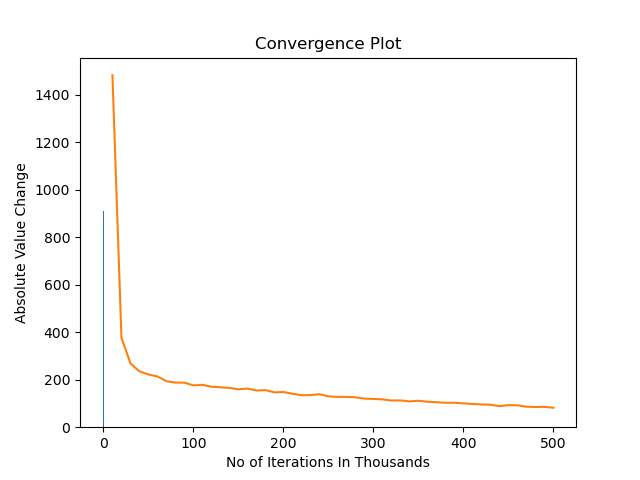
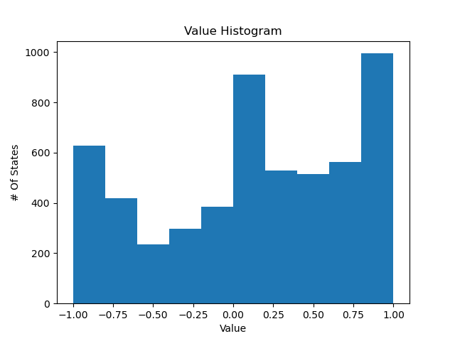
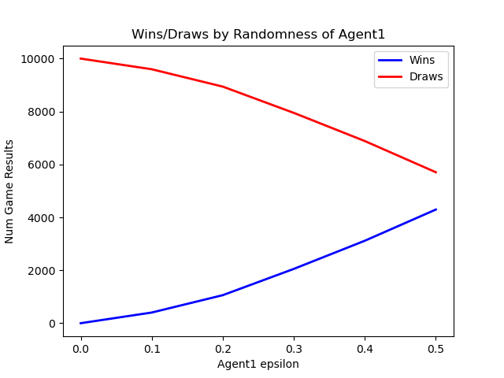

# Tic-Tac-Toe RL Project

An agent that learns to play Tic-Tac-Toe from scratch by playing hundreds of
thousands of games against itself.

## How it works

Tic-Tac-Toe is modeled as a Markov Decision Process: each board is a state,
each empty cell is an action, and the only reward comes at the end of the
game (`+1` win for X, `-1` win for O, `0` draw). Because the board is small
(under 5,500 reachable states), the whole thing is solved with a simple
lookup table, `V(state) -> estimated value`, rather than a neural network.

This is **TD(0) state-value learning** — the classic Sutton & Barto
Tic-Tac-Toe example — not Q-learning: it values *boards*, not
`(state, action)` pairs. Both X and O are the same agent, trained via
self-play with epsilon-greedy exploration. After each game, values are
updated backward from the outcome:

```
V(s) <- V(s) + learning_rate * (V(next_s) - V(s))
```

## Files

- `Board.py` — the game itself: legal moves, making/undoing a move, checking
  for a win/loss/draw.
- `Game.py` — the learning agent: self-play training (`learn_N_games`),
  saving/loading the trained value table, and playing/evaluating games
  (`auto_play_N_games`, `manual_play_one_game`).
- `generate_plots.py` — trains the agent and produces the graphs below.

## Running it

```bash
pip install matplotlib
python3 generate_plots.py
```

## Results

**Convergence** — total change in the value table drops as training
progresses:



**Learned values** — after training, most boards settle towards a firm
win/loss/draw value:



**Does it work?** — a fully trained agent (O, always playing its best move)
never loses, and wins more often as its opponent (X) plays more randomly:



At `epsilon = 0` (both sides playing their best move), every game is a draw
— exactly what optimal Tic-Tac-Toe play should produce.
